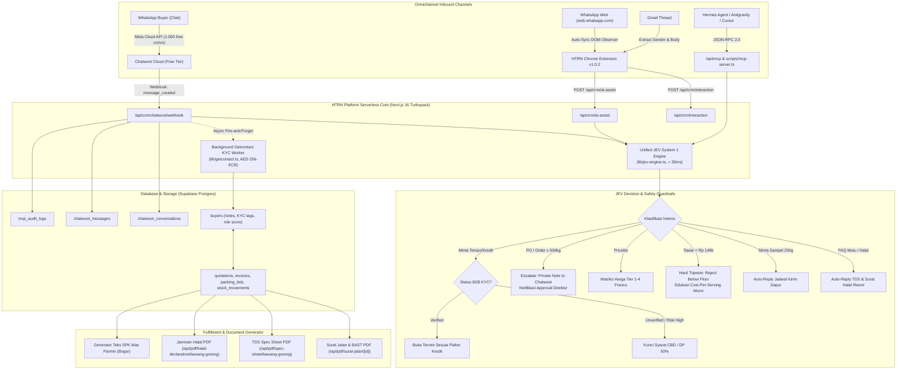
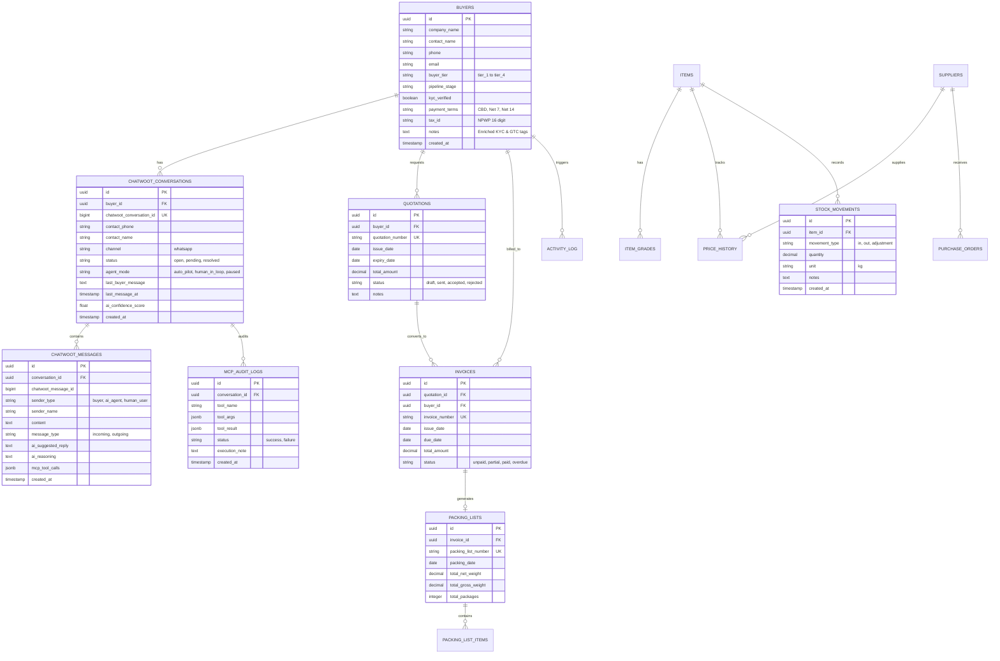

# Arsitektur Lengkap Sistem: HTRN Platform
**PT Haturan Spice Indonesia — Asset-Light B2B Agritech Trading & Omnichannel Agentic Architecture**

Dokumen ini mendokumentasikan arsitektur komprehensif, model bisnis maklon dropship, alur kognitif JEV System 1 & 2, integrasi omnichannel Chatwoot WhatsApp, proteksi margin, 4-Layer B2B KYC, dan skema database relasional (ERD).

---

## 1. Executive Summary & Model Bisnis

**PT Haturan Spice Indonesia** (`haturan.com`) beroperasi dengan model **Asset-Light B2B Commodity Trading**:
- **Zero Capex Pergudangan**: Perusahaan tidak menanggung biaya sewa gudang fisik, mesin pengering komersial, maupun armada truk pengiriman.
- **Fulfillment Hub Mas Parmin (CV Daun Mas, Bogor)**: Seluruh pemrosesan, sortasi bawang Brebes super murni tanpa tepung, de-oiling sentrifugal, dan pengemasan dialihdayakan 100% (*fully outsourced*).
- **Protokol Blind Shipping**:
  1. Armada Mas Parmin mengantarkan barang langsung ke pintu gudang/dapur pembeli (Jabodetabek).
  2. Pengiriman selalu dilengkapi **Surat Jalan & BAST resmi ber-kop surat PT Haturan Spice Indonesia** (ditandatangani Direktur Utama Pak Agung Gunawan).
  3. Kemasan bal (5 kg) dan master box (20 kg) beridentitas netral/Haturan, mencegah terjadinya disintermediasi (*buyer bypass*).

---

## 2. Diagram Arsitektur Tingkat Tinggi (High-Level Architecture)



---

## 3. Dual-Tier Cognitive Decision Architecture (JEV Paradigm)

Mengadopsi paradigma kecerdasan buatan **Jev (TypeSafe AI / Diogo Almeida)**:

### A. System 1: Fast Non-Autoregressive Decision Engine (`lib/jev-engine.ts`)
- **Latensi**: **< 30 ms**
- **Biaya**: **$0 / Rp 0** (tanpa pembakaran token LLM untuk pertanyaan berulang)
- **Zero-Hallucination**: Beroperasi deterministik menggunakan skema probabilitas terkalibrasi dan pencocokan teks presisi.
- **7 Intensi Terkalibrasi**:
  1. `SAMPLE_REQUEST`: Menangani permohonan sampel tester 250g bebas biaya untuk kitchen trial katering/resto.
  2. `FAQ_MUTU_CERT`: Mengirimkan fakta spesifikasi kadar air $\le 3\%$, minyak $\le 15\%$, tanpa tepung, dan tautan dokumen resmi.
  3. `PRICE_INQUIRY`: Menyajikan Matriks Harga Tier Volume resmi Haturan.
  4. `NEGOTIATION`: Menghitung batas diskon volume.
  5. `PO_CONFIRMATION`: Eskalasi pesanan resmi ke Direktur Utama.
  6. `PAYMENT_TERMS_INQUIRY`: Gatekeeper termin kredit (Net 7 / Net 14 / Net 30).
  7. `HIGH_RISK_SPAM`: Proteksi nomor spam dan nomor berisiko tinggi.

### B. System 2: Generative Frontier Synthesis & Human-in-the-Loop
- Hanya dipanggil ketika System 1 mendeteksi kasus kompleks:
  - Negosiasi kontrak pasokan $\ge 500$ kg / multi-ton.
  - Perjanjian harga penguncian jangka panjang (*3-month price-lock contract*).
  - Persetujuan plafon kredit tempo perusahaan.
- Dieksekusi melalui **Chatwoot Mobile App**, **Private Internal Note**, atau via perintah MCP oleh AI Assistant (Hermes / Antigravity).

---

## 4. Struktur Finansial & Batas Pengaman (Pricing & Safety Guardrails)

```
┌────────────────────────────────────────────────────────────────────────┐
│                        HTRN PRICING HIERARCHY                          │
├────────────────────────────────────────────────────────────────────────┤
│  📦 Tier 1 (100 – 499 kg)       : Rp 165.000 / kg  (Gross Margin: 40k) │
│  📦 Tier 2 (500 – 999 kg)       : Rp 155.000 / kg  (Gross Margin: 30k) │
│  📦 Tier 3 (1.000 – 2.000 kg)   : Rp 149.000 / kg  (Gross Margin: 24k) │
│  📦 Tier 4 (> 2.000 kg Kontrak) : Rp 144.000 / kg  (Gross Margin: 19k) │
├────────────────────────────────────────────────────────────────────────┤
│  🛡️ BATAS BAWAH NEGOSIASI (FLOOR) : Rp 140.000 / kg (Safety Tripwire)   │
├────────────────────────────────────────────────────────────────────────┤
│  🚚 Estimasi Ongkir & Box       : ~Rp 7.000 - Rp 8.000 / kg            │
│  🏭 HPP Modal Mas Parmin (Bogor): Rp 125.000 / kg                      │
│  🌱 Bahan Mentah Petani Brebes  : Rp 30.000 / kg (Rasio Susut 3.8x)    │
└────────────────────────────────────────────────────────────────────────┘
```

- **Istilah Resmi**:
  - **Matriks Harga Tier Volume** (`Volume Pricing Matrix`): Harga resmi yang tertera di menu buyer dan penawaran.
  - **Batas Bawah Negosiasi** (`Floor Price / Hard Floor Margin`): Batas harga absolut **Rp 140.000/kg**. Jika buyer menawar di bawah angka ini, JEV System 1 secara otomatis menolak dan membandingkan *Cost-Per-Serving* melawan bawang bertepung 15–20% pasaran.

---

## 5. 4-Layer Enterprise B2B KYC Architecture

```
Layer 1: Identity & Social Graph (Open-Source Getcontact Engine)
 ├── Reverse-engineered AES-256-ECB client (xdreizein666/getcontact-cli)
 ├── Background enrichment otomatis saat pesan WhatsApp masuk
 ├── Ekstraksi tags direktori telepon, nama pemanggil, dan spam count
 └── Fallback B2B Heuristic OSINT (Operator GSM & filter PSTN)

Layer 2: Corporate & Physical Reality Verification
 ├── Validasi NIB (Nomor Induk Berusaha 13 digit OSS Kemenkumham)
 ├── Validasi NPWP (16 digit Coretax DJP)
 └── Geocoding Google Maps alamat dapur pusat / gudang penerima

Layer 3: Dynamic Credit Governance & Risk-Based Terms
 ├── Pembeli Baru / Belum KYC : Wajib Cash Before Delivery (CBD) / DP 50%
 ├── 3x Order Lunas            : Terbuka Plafon Kredit Net 7 (Maks Rp 15 Juta)
 └── Kontrak Korporat Teruji   : Plafon Net 14 / Net 30 (Wajib Jaminan Giro)

Layer 4: JEV Real-Time Gatekeeper
 └── Otomatis memblokir permohonan tempo di WhatsApp jika KYC unverified
```

---

## 6. Entity Relationship Diagram (ERD Supabase Postgres)



---

## 7. Model Context Protocol (MCP) Manifest

Endpoint: `/api/mcp` (HTTP JSON-RPC 2.0) & `scripts/mcp-server.ts` (Stdio):

| MCP Tool Name | Parameter Input | Deskripsi & Fungsi |
|---|---|---|
| `htrn_jev_evaluate` | `text`, `buyer_id?`, `channel?` | Menjalankan evaluasi System 1 JEV (< 30ms): intensi, urgensi, batas harga bawah, dan draf balasan resmi. |
| `htrn_getcontact_lookup` | `phone`, `buyer_id?`, `company_name?` | Mengambil data tag Getcontact, jumlah spam, dan memperbarui skor KYC nomor buyer. |
| `htrn_chatwoot_get_conversations` | `status?`, `agent_mode?`, `limit?` | Mengambil daftar percakapan aktif dari Chatwoot / Supabase. |
| `htrn_chatwoot_reply_whatsapp` | `conversation_id`, `message`, `message_type` | Mengirim pesan balasan WhatsApp ke buyer atau internal note untuk Pak Agung. |
| `htrn_chatwoot_set_agent_mode` | `conversation_id`, `agent_mode` | Mengubah mode agen (`auto_pilot` / `human_in_loop` / `paused`). |
| `htrn_search_buyers` | `query`, `stage?`, `limit?` | Pencarian buyer di CRM berdasarkan nama, PIC, nomor HP, atau stage. |
| `htrn_get_buyer_profile` | `buyer_id` | Menampilkan profil lengkap buyer, status KYC, plafon kredit, dan riwayat transaksi. |
| `htrn_update_buyer_stage` | `buyer_id`, `stage`, `notes?` | Memperbarui tahap pipeline CRM buyer. |
| `htrn_verify_buyer_kyc` | `buyer_id`, `status`, `credit_limit?`, `allowed_terms?` | Memperbarui verifikasi legalitas B2B KYC (NIB & NPWP). |
| `htrn_get_pricing_intelligence` | `item_code?` | Menyajikan benchmark harga mentah petani Brebes, rasio susut, HPP modal, dan tiering. |
| `htrn_analyze_competitor_quote` | `competitor_price_per_kg`, `competitor_claim?` | Menganalisis kalkulasi rasio tepung kompetitor vs kehematan *Cost-Per-Serving* Haturan. |
| `htrn_get_sales_script` | `scenario`, `buyer_id?` | Menghasilkan skrip penawaran WhatsApp teruji (Sample, SPH, Cost-Per-Serving, Price-Lock). |
| `htrn_generate_mas_parmin_spk` | `quantity_kg`, `unit_selling_price`, `delivery_address` | Menghasilkan breakdown bal/box dan format teks WhatsApp SPK Mas Parmin Bogor. |
| `htrn_get_surat_jalan_link` | `order_id` | Mengambil tautan cetak PDF resmi Surat Jalan & BAST PT Haturan Spice Indonesia. |

---

## 8. Standar Keamanan & Kepatuhan Legal (Compliance)

1. **Hetzer Credential Safety, Runtime Boundary & Web Settings Vault**:
   - Seluruh token, access key, dan kredensial sensitif dilarang keras ditulis dalam kode atau repositori git (*zero plaintext git leakage*).
   - **Batasan Arsitektur Runtime & Armor**: Hetzer bertindak sebagai CLI armor, stream redactor, dan mapping `secretRef:<id>`. Di dalam proses server Next.js (Node.js runtime), kredensial yang dibutuhkan sistem dibaca ke memori proses melalui hierarki resolusi aman (`lib/secrets-helper.ts`) dan tabel database terenkripsi `app_secrets` (AES-256-GCM) dengan akses RLS terbatas pada `service_role`. Runtime server adalah application-level protected vault di dalam batas proses Node.js.
   - **Antarmuka Settings Integrasi (`/settings/integrations`)**: Pengguna dapat mengonfigurasi token Getcontact, Chatwoot, LLM AI, dan PIN Direktur langsung dari dashboard web tanpa perlu membuka terminal atau mengedit `.env.local`.
   - **Background Enkripsi & Referensi**: Di latar belakang, nilai disimpan ke tabel `app_secrets` dengan enkripsi AES-256-GCM dan otomatis dipetakan ke format `secretRef:<credential-id>`.
   - **Zero Plaintext API Response**: API `/api/settings/integrations` tidak pernah mengembalikan nilai mentah ke browser; data hanya ditampilkan dalam format terselubung (*masked*, misal: `••••••••••••a4f2`) atau penanda `secretRef:<id> (Tersimpan & Terenkripsi)`.
   - **Hierarki Resolusi Runtime (`lib/secrets-helper.ts`)**: `process.env` $\rightarrow$ In-Memory Cache $\rightarrow$ Enkripsi Database Vault (`app_secrets`).
2. **Kerahasiaan Vendor (Strict Privacy)**:
   - Nama Mas Parmin dan CV Daun Mas diproteksi ketat dan hanya tampil di internal founder dashboard. Dokumen publik mencantumkan fasilitas sebagai *"Fasilitas Pengolahan & Sentra Sortasi Mitra Haturan (Bogor, Jawa Barat)"*.
3. **Kepatuhan Non-Overclaim**:
   - Seluruh dokumen teknis (TDS) ditegaskan sebagai *Target Specification* industri B2B.
   - Jaminan Kehalalan merujuk pada kepatuhan SJPH fasilitas mitra dan bahan nabati bersertifikasi Halal & BPOM.

