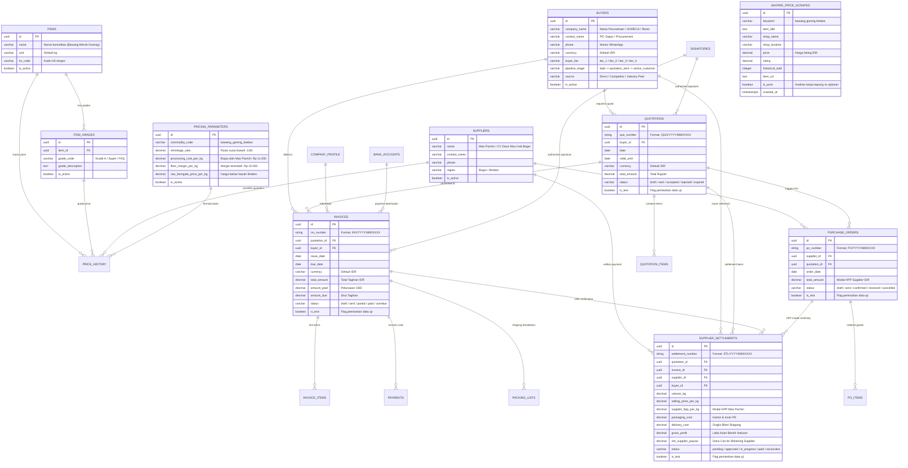

# Database Entity-Relationship Diagram (ERD) & Master Data Integrity
**PT Haturan Spice Indonesia (`HTRN Platform`)**
*Dokumen Arsitektur Master Data, Integritas Relasi, dan Kamus Database*

---

## 1. Visual Entity-Relationship Diagram (ERD)

---

## 2. Kamus Master Data & Aturan Relasi

### A. Komoditas & Kualitas (`items`, `item_grades`)
- Komoditas utama: **Bawang Merah Goreng Brebes (Daun Mas Hub Bogor)**.
- `item_grades`:
  - `Grade A`: Super Murni Brebes (0% Tepung Tapioka, Kadar Air < 3%, Minyak Nabati Kelapa).
  - `Grade B / Katering`: Renyah Gurih (Campuran Tepung Tipis < 5%).
  - `Curah Industri`: Kemasan Zak 25 kg untuk pabrik seasoning.

### B. Mitra & Pelanggan (`buyers`, `suppliers`)
- **Suppliers**: Fasilitas pemenuhan maklon (*Fulfillment Hub*), dipimpin oleh Mas Parmin (CV Daun Mas Bogor). Bertanggung jawab atas pengolahan, pengeringan, sortasi, dan pengemasan.
- **Buyers**: Pelanggan B2B (HORECA, Katering, Resto Jaringan).
- **Competitor Quarantine**: Catatan yang memiliki `source = 'Competitor / Industry Peer'` dikarantina dari cold outreach HORECA agar tidak membocorkan struktur harga penawaran.

### C. Alur Dokumen Komersial & Keuangan
$$\text{Quotation (SPH)} \longrightarrow \text{Invoice (Tagihan CBD)} \longrightarrow \text{Purchase Order (Mas Parmin)} \longrightarrow \text{Surat Jalan (Blind Shipping)} \longrightarrow \text{Supplier Settlement}$$

1. **Quotation**: Penawaran harga resmi dengan masa berlaku 7-14 hari.
2. **Invoice**: Faktur penagihan CBD (*Cash Before Delivery*) lengkap dengan rekening BCA / Mandiri PT Haturan Spice Indonesia.
3. **Purchase Order**: Perintah produksi dan pengemasan bal 5 kg & master carton 20 kg ke Mas Parmin dengan harga modal HPP terkunci.
4. **Surat Jalan & BAST**: Dokumen serah terima barang tanpa mencantumkan identitas supplier (protokol blind shipping).
5. **Supplier Settlement**: Pencatatan arus kas bagi hasil dan pencairan modal supplier setelah pembeli melunasi pembayaran CBD.

### D. Parameter Dinamis Anti-Hardcode (`pricing_parameters`)
Semua variabel matematika perhitungan harga bahan basah dan HPP disimpan di database:
- `shrinkage_ratio`: Rasio susut susut basah ke matang (default: **3.8**).
- `processing_cost_per_kg`: Biaya olah, bumbu, minyak, tenaga kerja, spinner (default: **Rp 11.000**).
- `floor_margin_per_kg`: Batas laba kotor minimum aman sebelum peringatan boncos (default: **Rp 15.000**).

### E. Standar Mata Uang & Pemisahan Lingkungan
1. **Mata Uang**: Seluruh transaksi wajib dalam **IDR (Rupiah / Rp)**.
2. **Flag Data Uji (`is_test`)**:
   - Nilai `false`: Data transaksi riil produksi (masuk ke laporan keuangan dan omset).
   - Nilai `true`: Data uji/simulasi (ditandai dengan badge khusus dan dikeluarkan dari pembukuan riil).
