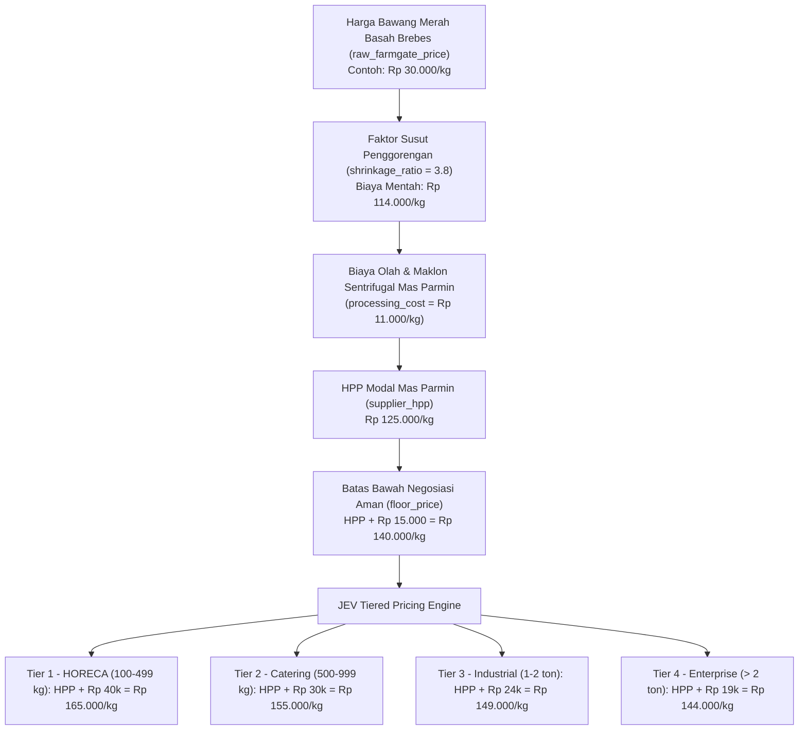

# Analisis Risiko Pasar, Intelijen Kompetitor, dan Pipeline Harga B2B
**Dokumen Strategis & Audit Teknis HTRN Platform**  
*Tanggal: 27 September 2026 | Penulis: Antigravity AI & Pak Agung Gunawan (Direktur PT Haturan Spice Indonesia)*

---

## 1. Ringkasan Eksekutif & Prinsip Dasar (Zero Gimmick)

Sebagai founder dan direktur berlatar belakang teknologi informasi (IT), Pak Agung Gunawan menekankan prinsip ketat:
> **"Data pasar dan kompetitor harus 100% riil dan dapat dipertanggungjawabkan. Jika data tidak bisa didapatkan secara valid, lebih baik jangan tampilkan data dummy atau jangan sama sekali diimplementasikan."**

Perdagangan komoditas rempah B2B (khususnya Bawang Merah Goreng industri) memiliki karakteristik pasar **tertutup (*closed-door private negotiation*)**. Tidak ada open API publik atau bursa berjangka resmi untuk produk olahan ini di Indonesia. 

Oleh karena itu, platform **dilarang keras memunculkan simulasi grafik harga palsu atau data acuan pasar buatan**. Seluruh keputusan komersial harus berakar pada formula dekomposisi biaya riil, data panen sentra, dan intelijen lapangan tervalidasi.

---

## 2. Bedah Kritis Data E-Commerce (Shopee / Tokopedia) untuk B2B

### Apakah Data Shopee Valid untuk Acuan B2B?
**Kesimpulan: Shopee VALID sebagai instrumen pencarian kontak supplier tangan pertama, tetapi TIDAK VALID jika dijadikan acuan harga B2B secara langsung tanpa verifikasi.**

### 3 Bias Utama Harga Marketplace Retail:
1. **Jebakan Campuran Tepung (Adulteration Trap)**:
   - Di Shopee banyak produk berlabel "Bawang Goreng" seharga **Rp 75.000 – Rp 95.000/kg**.
   - *Fakta Teknis*: Dengan harga bawang merah basah petani Brebes Rp 28.000 – Rp 32.000/kg dan rasio susut $3.8 : 1$, **modal bahan mentahnya saja Rp 106.400 – Rp 121.600/kg**.
   - Produk di bawah Rp 100.000/kg di e-commerce **100% menggunakan campuran tepung tapioka 15% – 25%** dan kadar minyak tinggi (tanpa sentrifugal de-oiling).
   - Membandingkan produk murni Haturan (0% tepung, sentrifugal tiris minyak) dengan harga Shopee termurah adalah perbandingan yang menyesatkan (*apples-to-oranges*).
2. **Biaya Admin & Packaging Retail (Markup 6% – 12%)**:
   - Seller Star/Mall di Shopee dikenakan komisi dan biaya layanan 6.5% – 10%, plus biaya packaging satuan eceran. Harga jual offline B2B mereka umumnya **10% – 15% lebih murah** dari harga etalase Shopee.
3. **Mekanisme Logistik**:
   - Shopee berbasis kurir ritel (J&T, SiCepat). Transaksi B2B Haturan berbobot 100 – 500 kg menggunakan kargo Lalamove/Deliveree/Indah Cargo dengan sistem *Franco* (ongkir ditanggung penjual sampai gudang/dapur buyer).

### Protokol Memanfaatkan Shopee Secara Benar:
- Filter toko berstatus *Star Seller* berlokasi di **Sentra Produsen (Brebes, Nganjuk, Probolinggo)** dengan penjualan > 5.000 pcs.
- Ambil nomor WhatsApp admin B2B/partai besar yang tercantum di deskripsi toko.
- Lakukan kontak langsung di luar marketplace untuk mendapatkan pricelist sak karung 25 kg / bal 5 kg murni.

---

## 3. Audit Entitas: Pemisahan Buyer Murni vs Kompetitor / Pabrik Bumbu

Di database awal prospek CRM, teridentifikasi 6 entitas yang **bukan buyer pengguna akhir (HORECA/Resto)**, melainkan sesama **pabrik bumbu, maklon seasoning, atau distributor**:

```
                         [DATABASE CRM]
                               │
            ┌──────────────────┴──────────────────┐
            ▼                                     ▼
   [BUYER MURNI (HORECA)]              [KOMPETITOR / PEER]
   - Bakso Boedjangan (500 kg)         - Golden Seasoning Factory
   - Restu Mande (Padang)              - PT Kreasi Rasa Inti Selera (KRAIS)
   - PT Paradise Seera Abadi           - Joze Food (Distributor Bogor)
   - Citra Boga Catering               - PT AIMFOOD Manufacturing
   - Miranty Catering                  - PT Karawang Foods Lestari
   - PT Boga Mitra Sarana              - UFI Masuya Nusantara
            │                                     │
    Kirim Penawaran Haturan               JANGAN DIKIRIM PENAWARAN!
   (Harga Jual Rp 155k - 165k)            Gunakan untuk Mystery Shopping
```

### Risiko Fatal Jika Mengirim Penawaran ke Kompetitor:
1. **Harga Menjadi Bumerang**: Mereka membeli bahan baku dalam volume puluhan ton langsung dari petani/tengkulak Brebes. Jika Haturan menawarkan harga end-buyer (Rp 155.000/kg), mereka akan menganggap harga Haturan kemahalan, atau
2. **Kebocoran Struktur Margin**: Mereka mengetahui struktur HPP dan formula penawaran Haturan, sehingga dapat memotong (*undercut*) penawaran Haturan ke buyer seperti Bakso Boedjangan.

### 📋 Daftar Entitas Kompetitor & Lembar Kerja Mystery Shopping

Data berikut telah diubah kategorinya di database menjadi `source: 'Competitor / Industry Peer'` dan diberi penanda `[ROLE: COMPETITOR / INDUSTRY PEER - JANGAN COLD OUTREACH HARGA HORECA]`:

| Nama Entitas | Kontak / WhatsApp | Profil Lapangan | Parameter Mystery Shopping (WA Pribadi Pak Agung) |
|---|---|---|---|
| **Golden Seasoning Factory** (Katapang, Kab. Bandung) | `+62 895-7084-11411` | Pabrik bumbu tabur & seasoning gurih | Tanya harga bawang goreng kemasan bal 5kg & karung. Cek kadar tepung dan harga Franco Bandung. |
| **PT Kreasi Rasa Inti Selera (KRAIS)** (Bekasi) | `+62 819-9505-0266` (Ibu Siti Nurbayti) | Pabrik seasoning snack, mie & olahan daging | Tanya apakah menjual bawang goreng slice lepasan atau hanya untuk premix bumbu. |
| **Joze Food** (Bogor) | `0852-1698-0637` | Distributor bahan baku HORECA Bogor | Cek harga pasaran mereka ke restoran Bogor untuk mengetahui margin kompetisi lokal sesama Bogor. |
| **PT AIMFOOD Manufacturing Indonesia** (MM2100 Cikarang) | `021-2961-8989` | Pabrik maklon pangan & kaldu bumbu | Cek apakah menerima maklon bawang goreng atau membutuhkan pasokan bahan baku. |
| **PT Karawang Foods Lestari** (Cikarang) | `021-2961-7899` | Pabrik bahan baku saus & bumbu | Cek harga jual bawang giling kasar & irisan mereka. |
| **UFI Masuya Nusantara** (Bekasi) | `021-8265-2411` | Produsen bumbu gurih & saus | Cek sumber pasokan dan harga jual partai industri. |

---

## 4. Pipeline Aliran Variabel & Formula Dinamis Harga Pokok Penjualan (HPP)

Perhitungan harga Haturan harus mengikuti pipeline matematis berjenjang:

$$\text{Harga Bahan Basah Petani} \xrightarrow{\times \text{Susut}} \text{Biaya Mentah} \xrightarrow{+ \text{Biaya Olah}} \text{HPP Mas Parmin} \xrightarrow{+ \text{Floor Margin}} \text{Harga Dasar Aman} \xrightarrow{+ \text{Tier Margin}} \text{Harga Jual Final}$$



### Dekomposisi Variabel:
1. **$P_{\text{raw}}$ (Harga Bahan Baku Basah)**: Input variabel dinamis dari sentra Brebes (Rp 20.000 – Rp 45.000/kg).
2. **$R_{\text{shrink}}$ (Rasio Susut)**: Konstanta industri $3.8$ (butuh 3,8 kg basah untuk menghasilkan 1 kg goreng murni).
3. **$C_{\text{proc}}$ (Biaya Proses & Maklon)**: Rp 11.000/kg (minyak kelapa sawit industri, gas LPG, listrik sentrifugal de-oiling, upah kupas/iris, plastik inner PE).
4. **$\text{HPP}_{\text{modal}}$**: 
   $$\text{HPP}_{\text{modal}} = (P_{\text{raw}} \times R_{\text{shrink}}) + C_{\text{proc}}$$
   *Simulasi*: $(30.000 \times 3.8) + 11.000 = \text{Rp } 125.000/\text{kg}$.
5. **$P_{\text{floor}}$ (Batas Bawah Negosiasi JEV)**:
   $$P_{\text{floor}} = \text{HPP}_{\text{modal}} + \text{Rp } 15.000 = \text{Rp } 140.000/\text{kg}$$
   *Tujuan*: Menjamin biaya karton master box (Rp 12.000/box) dan ongkir Franco (Rp 350.000) selalu tertutup dengan margin bersih minimal 10%.
6. **$P_{\text{tier}}$ (Harga Penawaran Berdasarkan Skala Volume)**:
   - HORECA (100–499 kg): $\text{HPP} + \text{Rp } 40.000 = \text{Rp } 165.000$ (Margin ~24.2%)
   - Catering (500–999 kg): $\text{HPP} + \text{Rp } 30.000 = \text{Rp } 155.000$ (Margin ~19.3%)
   - Industrial (1.000–2.000 kg): $\text{HPP} + \text{Rp } 24.000 = \text{Rp } 149.000$ (Margin ~16.1%)
   - Enterprise (> 2.000 kg): $\text{HPP} + \text{Rp } 19.000 = \text{Rp } 144.000$ (Margin ~13.2%)

---

## 5. Logika & Guardrail JEV (Job Execution Engine)

JEV mengimplementasikan 3 guardrails otomatis:

1. **Auto-Escalation on Raw Price Spike**:
   - Ketika harga bawang merah basah ($P_{\text{raw}}$) naik dari Rp 30.000 ke Rp 35.000:
     - HPP otomatis naik menjadi: $(35.000 \times 3.8) + 11.000 = \text{Rp } 144.000/\text{kg}$.
     - Floor Price otomatis terkerek naik ke **Rp 159.000/kg**.
     - Harga Tier 2 Catering naik ke **Rp 174.000/kg**.
   - JEV secara otomatis mendeteksi jika ada Quotation berstatus `draft` atau `sent` yang harganya berada di bawah Floor Price baru, dan memicu peringatan *QUOTATION_MARGIN_AT_RISK*.
2. **Rejection Floor Hardstop**:
   - JEV memblokir pembuatan Quotation atau Invoice jika `unit_price < floor_price` kecuali ada bypass override resmi dari Direktur Utama (Agung Gunawan).
3. **Competitor Quarantine Gate**:
   - Agen JEV memvalidasi `buyer.source !== 'Competitor / Industry Peer'` sebelum menjalankan sales outreach otomatis atau dispatching sampel gratis.

---

## 6. Rekomendasi Arsitektur UI

**Pertanyaan Pak Agung**: *Apakah perlu di menu spesifik?*

**Rekomendasi Arsitektur (Tidak Over-Engineering & Efisien)**:
- **Jangan buat root menu baru di sidebar** agar navigasi aplikasi tetap bersih dan fokus pada alur kerja harian.
- Buat submodule terpadu di dalam lingkup **Harga Rempah (`/prices`)**:
  - Halaman: `app/(dashboard)/prices/market-intelligence/page.tsx`
  - Dilengkapi tab navigasi di bagian atas halaman `/prices`:
    1. **Katalog & Histori Harga Jual** (`/prices`)
    2. **Kalkulator Dinamika Bahan Baku & HPP** (`/prices/market-intelligence`)
    3. **Pencatatan Harga Harian** (`/prices/input`)
- Di halaman tersebut disediakan:
  1. **Interactive Live HPP Simulator**: Slider interaktif harga bawang basah (Rp 20k – Rp 45k) yang secara instan menunjukkan perubahan HPP Mas Parmin, Floor Price, dan 4 Tier Penjualan.
  2. **Tabel Competitor Benchmark**: Lembar kerja intelijen untuk mencatat hasil tanya harga via WA pribadi Pak Agung ke Golden Seasoning, Joze Food, KRAIS, dll.
  3. **Tombol "Simpan Sebagai Acuan Aktif"**: Menyimpan variabel harga bahan baku aktif ke database (`price_history`) sehingga seluruh sistem mengacu pada data yang sama.
