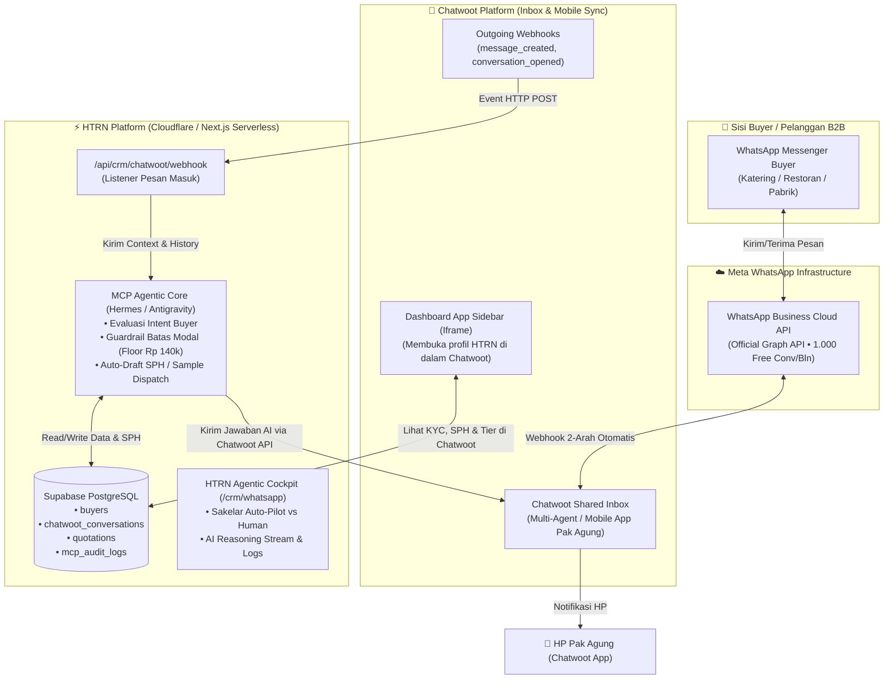
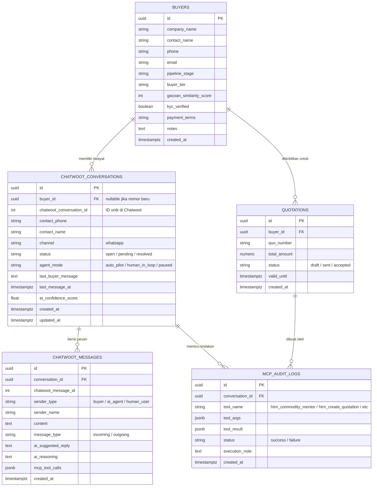

# Arsitektur Sistem: Chatwoot + Meta WhatsApp Cloud API + HTRN Agentic MCP
**Solusi 100% Serverless, Free-Tier Cloudflare/Next.js, & Asset-Light B2B Operations**

---

## 🎯 Visi & Kebutuhan Pak Agung Gunawan
1. **Otonom Saat Jauh dari Laptop (Always-On Agentic AI)**:
   - Ketika Pak Agung sedang bepergian atau tidak di depan monitor, AI Agent berbasis **MCP (Model Context Protocol)** secara otonom menyambut buyer, menjawab pertanyaan spesifikasi/TDS, mengecek harga pasar terkini, dan menyusun draf penawaran (*Quotation/SPH*).
2. **0 Biaya Server & 0 Maintenance Docker (Tanpa WAHA)**:
   - Tidak perlu menyewa VPS Linux khusus untuk menjalankan kontainer WAHA.
   - Menggunakan integrasi resmi **Meta WhatsApp Business Cloud API** yang disambungkan langsung ke **Chatwoot** (memanfaatkan jatah 1.000 percakapan gratis per bulan dari Meta).
3. **Kendali Penuh dari HP (Mobile First via Chatwoot Mobile App)**:
   - Pak Agung dapat memantau percakapan buyer secara real-time dari aplikasi HP Chatwoot (Android/iOS), menerima notifikasi instan, serta mengambil alih chat kapan saja (*Human-in-the-Loop*).

---

## 🏗️ Diagram Arsitektur Komprehensif



---

## 🗄️ Entity Relationship Diagram (ERD)

Struktur relasi tabel di database Supabase untuk mendukung sinkronisasi obrolan, status agen otonom, dan riwayat tindakan MCP:



---

## 🤖 Logika & Alur Kerja Agentic MCP (Otonom saat Pak Agung AFK)

Ketika sebuah pesan WhatsApp masuk dari buyer:

### 1. Tingkat 1 (System 1 - FAQ, Mutu, & Dokumen Legalitas)
- **Buyer Tanya**: *"Bawang gorengnya murni tanpa tepung tidak ya? Boleh minta sertifikat halal dan TDS speknya?"*
- **Aksi Agen MCP**:
  - Mengambil dokumen resmi via tool `htrn_get_document_link` (TDS Spek Bawang Goreng & Surat Pernyataan SJPH Halal Haturan).
  - Mengirim jawaban ramah, edukasi mutu susut $3.8\times$, dan tautan PDF langsung ke WhatsApp buyer.
  - Memperbarui status buyer di CRM menjadi `target_outreach` $\rightarrow$ `verified_active`.

### 2. Tingkat 2 (System 2 - Negosiasi Harga & Penawaran SPH)
- **Buyer Tanya**: *"Kami butuh 300 kg per bulan untuk katering di Bekasi. Bisa dapat harga berapa per kg?"*
- **Aksi Agen MCP**:
  1. Memanggil tool `htrn_commodity_mentor` untuk memeriksa harga pasar Bapanas & Kramat Jati hari ini.
  2. Mengecek batasan modal (*Floor Price Enforcement*): Tidak boleh menjual di bawah Rp 140.000/kg.
  3. Mengklasifikasikan buyer ke **Tier 2 (Volume 100–499 kg $\rightarrow$ Rp 155.000/kg Franco Jabodetabek)** dengan termin CBD / DP 50%.
  4. Memanggil tool `htrn_create_quotation` untuk meng-generate nomor SPH resmi di database.
  5. **Evaluasi Sakelar Mode**:
     - Jika mode **`auto_pilot`**: Agen langsung mengirimkan ringkasan SPH dan penawaran sampel tester 250g ke buyer.
     - Jika mode **`human_in_loop`**: Agen membuat draf balasan di Chatwoot dan mengirimkan notifikasi *Push Notification* ke HP Pak Agung: *"Buyer minta harga 300kg, rekomendasi harga Rp 155.000/kg sudah siap. Klik Setujui."*

---

## 🎨 Desain UI/UX (Dua Antarmuka Terpadu)

### Antarmuka 1: Chatwoot Dashboard App (Sidebar Data HTRN di dalam Chatwoot)
*Tampil di sisi kanan layar saat Pak Agung atau staf membuka obrolan di Chatwoot Web/Mobile:*

```
┌───────────────────────────────────────┬────────────────────────────────────────┐
│  💬 CHAT AREA (WhatsApp Web)          │  🛡️ HTRN B2B COCKPIT (Embedded App)    │
├───────────────────────────────────────┼────────────────────────────────────────┤
│ Buyer: Halo, minta info harga untuk   │ PT Berkah Katering Nusantara           │
│ katering 200 kg/bln ya.               │ PIC: Pak Bambang (Bekasi)              │
│                                       ├────────────────────────────────────────┤
│ [11:42]                               │ 🛡️ B2B KYC: [🔒 Terkunci CBD]          │
│                                       │ 📊 Tier: [Tier 2] • 🎯 Fit: 75%        │
│ 🤖 HTRN AI Agent:                     ├────────────────────────────────────────┤
│ Halo Pak Bambang! Untuk kebutuhan     │ Mode Agen:                             │
│ katering 200 kg/bulan, Haturan        │ (●) 🤖 Auto-Pilot  ( ) 👤 Manual       │
│ menyediakan Grade Brebes Super Murni  ├────────────────────────────────────────┤
│ dengan harga volume Rp 155.000/kg...  │ Tindakan Cepat (1-Klik):               │
│                                       │ [📄 Buat SPH Rp 155k]                  │
│                                       │ [🎁 Kirim Sampel 250g]                 │
│                                       │ [📦 Siapkan SPK Mas Parmin]            │
└───────────────────────────────────────┴────────────────────────────────────────┘
```

### Antarmuka 2: HTRN Platform Agentic WhatsApp Console (`/buyers` atau `/crm/whatsapp`)
*Tampil di dalam dashboard utama HTRN Platform:*

1. **Header Cockpit**:
   - Status Koneksi: `🟢 WhatsApp Cloud API Active (Meta Official)`
   - Kuota Percakapan Gratis: `142 / 1.000 digunakan bulan ini`
   - Sakelar Master AI: `[ Aktifkan Auto-Pilot Seluruh Kontak ]`
2. **Feed Obrolan Interaktif**:
   - Menampilkan percakapan terbaru dengan label status verifikasi (`✓ WA Aktif`, `✕ Bukan WA`).
   - Tombol pengambilalihan obrolan (*Take Over Chat*) dalam satu klik.
3. **AI Reasoning Drawer (Kotak Pikir Agen)**:
   - Menampilkan catatan transparan mengapa agen memilih harga tertentu, data pasar apa yang dianalisis, dan tool MCP apa yang dipanggil.
